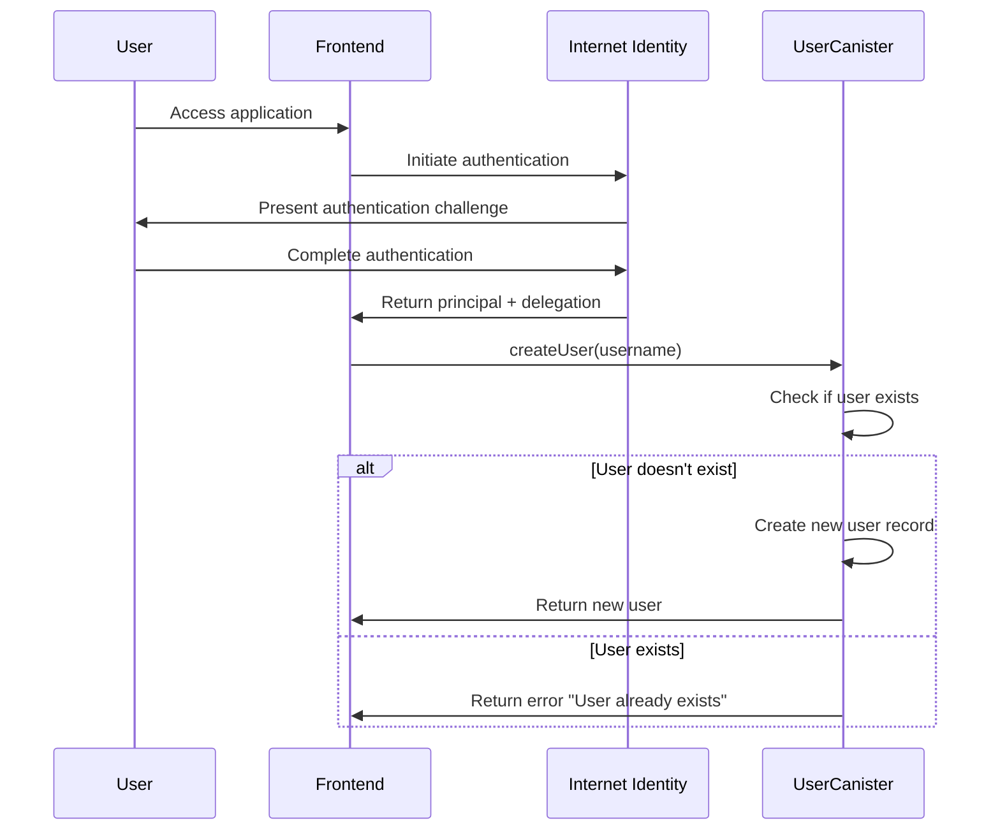
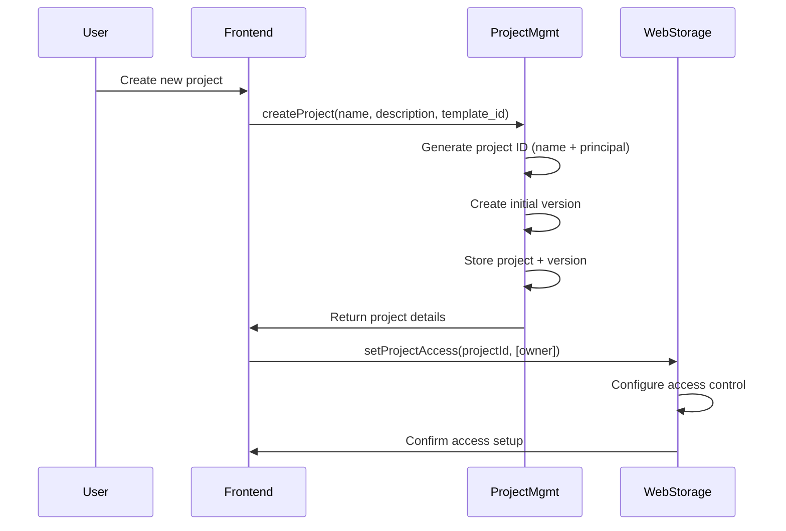
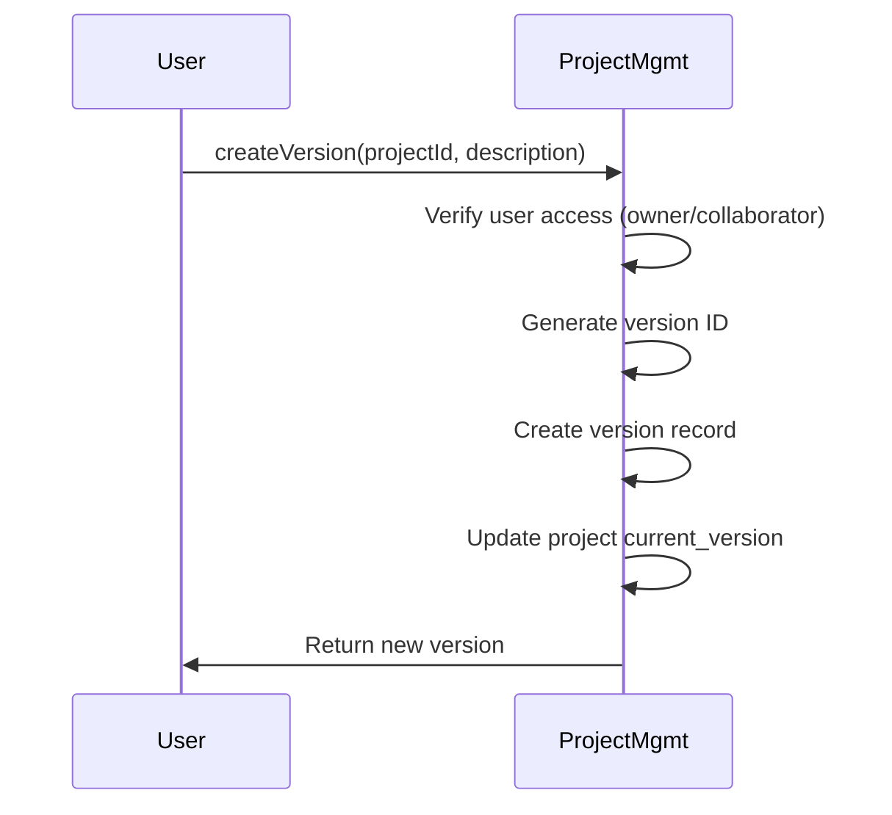
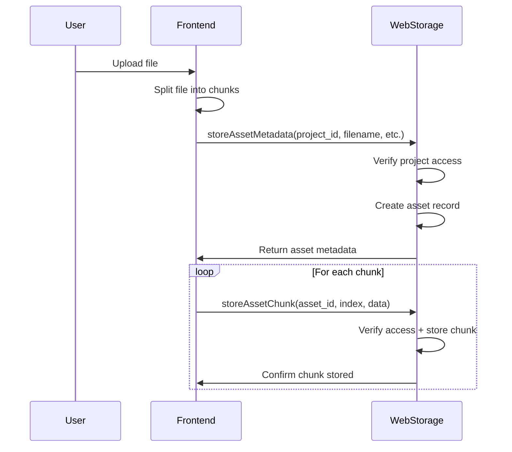
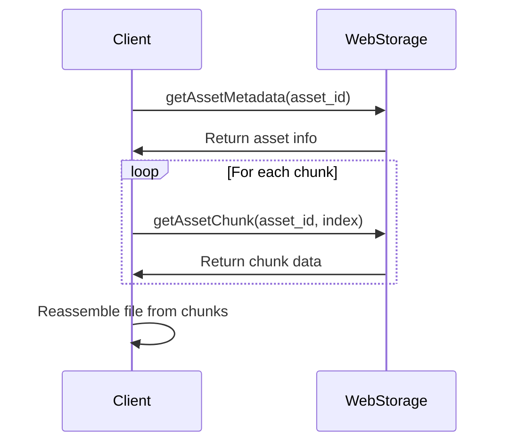
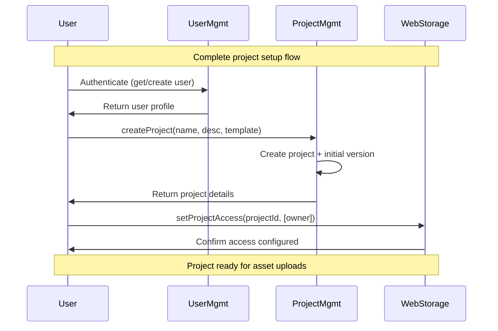
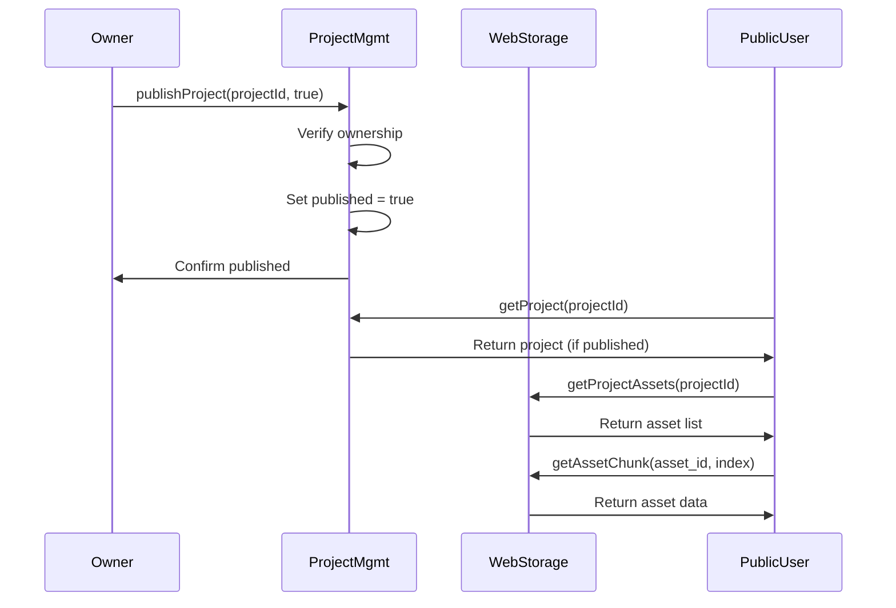

# Lessly Canister Flow

This document details the interactions between different canisters in the Lessly platform and visualizes the data flow for key user journeys.

## User Authentication Flow

```
┌─────────────┐      1. Register/Login      ┌─────────────┐
│    Client   │ ─────────────────────────► │     User     │
│  (Browser)  │ ◄───────────────────────── │   Canister   │
└─────────────┘      2. User Identity       └─────────────┘
       │                                           │
       │                                           │
       │ 3. Access Project                         │ 4. Verify User 
       ▼                                           ▼
┌─────────────┐                            ┌─────────────┐
│   Project   │ ◄──────────────────────── │ Internet    │
│   Canister  │                            │ Identity    │
└─────────────┘                            └─────────────┘
```

1. User initiates authentication via Internet Identity integration
2. User Canister creates or retrieves the user profile
3. Client requests project access with authenticated identity
4. User Canister verifies identity with Internet Identity for secure operations

### Detailed Steps:
- Client connects to Internet Identity for secure authentication
- On successful authentication, the principal is passed to User Canister
- User Canister creates a new user profile if first login, or retrieves existing one
- Client receives user profile information and authentication status
- For subsequent operations, the client's principal is used to verify permissions

## Project Creation and Management Flow

```
┌─────────────┐      1. Create Project      ┌─────────────┐
│ Authenticated│ ─────────────────────────► │   Project   │
│    Client   │ ◄───────────────────────── │   Canister   │
└─────────────┘      2. Project Details     └─────────────┘
       │                                           │
       │                                           │
       │ 3. Configure Access                       │ 4. Setup Storage
       ▼                                           ▼
┌─────────────┐      5. Access Config      ┌─────────────┐
│  Website    │ ◄───────────────────────── │  Website    │
│  Storage    │                            │  Renderer   │
└─────────────┘                            └─────────────┘
```

1. Authenticated user submits project details to create a new website project
2. Project Canister creates project record and initial version
3. Client configures access controls for the project assets
4. Project Canister coordinates with Website Storage for asset management
5. Website Storage and Website Renderer are configured with access permissions

### Detailed Steps:
- Client submits project name, description, and optional template ID
- Project Canister generates a unique project ID and creates metadata
- Initial project version is created as "v1" with timestamp
- Project access controls are established for the owner
- Storage space is logically allocated for the project assets
- Default project settings are established (unpublished state)

## Asset Upload and Management Flow

```
┌─────────────┐      1. Request Upload      ┌─────────────┐
│ Authenticated│ ─────────────────────────► │   Website   │
│    Client   │ ◄───────────────────────── │   Storage   │
└─────────────┘      2. Upload Approval     └─────────────┘
       │                                           │
       │                                           │
       │ 3. Upload Asset Chunks                    │ 4. Verify Access
       │ (Multiple Iterations)                     │
       ▼                                           ▼
┌─────────────┐                            ┌─────────────┐
│ Asset Store │                            │   Project   │
│ (Chunks)    │                            │   Canister  │
└─────────────┘                            └─────────────┘
       │
       │ 5. Confirm Upload
       ▼
┌─────────────┐     6. Update Metadata     ┌─────────────┐
│ Authenticated│ ─────────────────────────► │   Website   │
│    Client   │ ◄───────────────────────── │   Storage   │
└─────────────┘    7. Upload Complete      └─────────────┘
```

1. Client initiates asset upload process by sending metadata
2. Website Storage approves upload and provides upload instructions
3. Client uploads asset in multiple chunks for efficient handling
4. Website Storage verifies project access permissions
5. Client confirms completion of all chunk uploads
6. Website Storage updates asset metadata and associates with project
7. Client receives confirmation of successful upload

### Detailed Steps:
- Client sends asset metadata (filename, type, size) to Website Storage
- Website Storage validates user's project access with Project Canister
- For large files, client breaks the asset into chunks (e.g., 2MB each)
- Each chunk is uploaded separately with chunk index
- Website Storage assembles chunks and verifies complete asset
- Asset is associated with the current project version
- Client can then reference the asset in website content

## Website Rendering and Serving Flow

```
┌─────────────┐      1. HTTP Request       ┌─────────────┐
│    Visitor  │ ─────────────────────────► │   Website   │
│  (Browser)  │                            │   Renderer  │
└─────────────┘                            └─────────────┘
                                                  │
                    2. Domain Resolution          │
                    ┌───────────────────────────┘
                    │
                    ▼
             ┌─────────────┐
             │Domain Mapper│
             │ (Internal)  │
             └─────────────┘
                    │
                    │ 3. Identify Project
                    ▼
             ┌─────────────┐    4. Verify Project  ┌─────────────┐
             │   Request   │────────────────────► │   Project   │
             │  Handler    │◄──────────────────── │   Canister  │
             └─────────────┘    5. Project Data   └─────────────┘
                    │
                    │ 6. Request Assets
                    ▼
             ┌─────────────┐
             │   Website   │
             │   Storage   │
             └─────────────┘
                    │
                    │ 7. Return Assets
                    ▼
             ┌─────────────┐
             │   Assets    │
             │  Processor  │
             └─────────────┘
                    │
                    │ 8. HTTP Response
                    ▼
┌─────────────┐      9. Website Content    ┌─────────────┐
│    Visitor  │ ◄───────────────────────── │   Website   │
│  (Browser)  │                            │   Renderer  │
└─────────────┘                            └─────────────┘
```

1. Visitor's browser sends HTTP request to Website Renderer
2. Renderer analyzes URL to identify domain
3. Domain is mapped to a specific project
4. Renderer verifies project status with Project Canister
5. Project Canister returns project metadata and version
6. Renderer requests needed assets from Website Storage
7. Website Storage returns asset data, potentially in chunks
8. Renderer processes and assembles the complete response
9. Visitor receives the website content with appropriate MIME types

### Detailed Steps:
- Visitor navigates to custom domain or canister URL
- Website Renderer processes the URL and identifies project ID
- Renderer verifies project is published and accessible
- Based on URL path, Renderer determines required assets
- For each asset, Renderer queries Website Storage
- Large assets are streamed in chunks for efficient delivery
- Renderer sets appropriate HTTP headers for content type and caching
- Complete webpage or asset is delivered to visitor's browser

## Version Management Flow

```
┌─────────────┐    1. Create New Version    ┌─────────────┐
│   Project   │ ─────────────────────────► │  Project    │
│    Owner    │ ◄───────────────────────── │  Canister   │
└─────────────┘    2. Version Created      └─────────────┘
       │                                          │
       │ 3. Upload Assets                         │
       │    for New Version                       │ 4. Update Version
       ▼                                          ▼    Reference
┌─────────────┐                           ┌─────────────┐
│   Website   │ ───────────────────────► │   Version   │
│   Storage   │                           │    Store    │
└─────────────┘                           └─────────────┘
       │
       │ 5. Assets Tagged
       │    with Version ID
       ▼
┌─────────────┐    6. Publish Version     ┌─────────────┐
│   Project   │ ─────────────────────────► │  Website   │
│    Owner    │ ◄───────────────────────── │  Renderer  │
└─────────────┘    7. Version Live        └─────────────┘
```

1. Project owner initiates creation of a new project version
2. Project Canister creates new version record with metadata
3. Owner uploads or modifies assets for the new version
4. Project Canister updates the current version reference
5. Website Storage tags assets with the version ID
6. Owner publishes the new version when ready
7. Website Renderer begins serving the new version

### Detailed Steps:
- Project owner creates new version with description and timestamp
- New version ID is generated and associated with the project
- Owner uploads modified assets for the new version
- Each asset is tagged with the version ID for tracking
- Owner can test the new version before publishing
- When ready, owner marks the new version as current
- Website Renderer immediately begins serving the new version

## Domain Management Flow

```
┌─────────────┐      1. Link Domain        ┌─────────────┐
│   Project   │ ─────────────────────────► │   Website   │
│    Owner    │                            │   Renderer  │
└─────────────┘                            └─────────────┘
                                                  │
                      2. Verify Project           │
                       Ownership                  │
                      ┌────────────────────────┘
                      │
                      ▼
               ┌─────────────┐
               │   Project   │
               │   Canister  │
               └─────────────┘
                      │
                      │ 3. Ownership Confirmed
                      ▼
               ┌─────────────┐
               │   Domain    │
               │   Mapper    │
               └─────────────┘
                      │
                      │ 4. Domain Linked
                      ▼
┌─────────────┐      5. Configuration       ┌─────────────┐
│   Project   │ ◄───────────────────────── │   Website   │
│    Owner    │    Instructions            │   Renderer  │
└─────────────┘                            └─────────────┘
```

1. Project owner submits custom domain to associate with project
2. Website Renderer verifies the owner's permission on the project
3. Project Canister confirms owner's identity and project status
4. Domain Mapper associates domain name with specific project ID
5. Owner receives DNS configuration instructions to complete setup

### Detailed Steps:
- Project owner submits desired custom domain name
- Website Renderer validates domain format and availability
- Project ownership is verified with Project Canister
- Domain mapping is stored in Website Renderer's domain registry
- Owner receives instructions to configure DNS settings
- When DNS propagation completes, domain begins routing to project
- Visitors can now access the website via the custom domain

## Inter-Canister Communication Details

All inter-canister communication is implemented using Motoko's async/await pattern:

```motoko
// Example: Website Renderer fetching assets from Storage
public func http_request(request : HttpRequest) : async HttpResponse {
  let url = request.url;
  
  // Get project ID from URL
  switch (getProjectIdFromUrl(url)) {
    case (?project_id) {
      // Get the asset path
      let asset_path = getAssetPathFromUrl(url);
      
      // Async call to Storage canister
      try {
        let projectAssets = await storageCanister.getProjectAssets(project_id);
        
        // Process assets and build response
        // ...
      }
      catch (e) {
        // Handle error
      }
    }
    case null {
      // Project not found
    }
  }
}
```

Benefits of this architecture:
- **Separation of Concerns**: Each canister focuses on specific responsibilities
- **Scalability**: Canisters can be replicated or sharded as needed
- **Security**: Access controls at canister boundaries prevent unauthorized operations
- **Maintainability**: Canister upgrades can happen independently
- **Resilience**: Failures in one canister don't necessarily affect others

# Canister Flow Documentation

## Overview

This document describes the data flow and interaction patterns between Lessly's three main canisters: User Management, Project Management, and Website Storage. All interactions are based on the actual Motoko implementation.

## Authentication Flow

### User Registration and Login



### Key Implementation Details

- **Principal-based Identity**: Uses IC Principal from message caller for authentication
- **Duplicate Prevention**: `createUser` checks existing users before creation
- **Subscription Tiers**: New users default to `#free` tier
- **Timestamps**: Records creation and update timestamps automatically

## Project Management Flow

### Project Creation



### Project Access Control

The system implements a multi-layered access control:

1. **Owner Access**: Full control over project settings, collaboration, and publishing
2. **Collaborator Access**: Edit permissions for project content and assets
3. **Query Access**: Public read access for published projects

### Version Management



**Version ID Generation**: `"v" + sequenceNumber + "-" + projectId`

## Asset Storage Flow

### File Upload Process



### Asset Retrieval Process



### Chunking Strategy

- **Chunk Size**: Configurable based on canister memory constraints
- **Sequential Storage**: Chunks stored with sequential index numbers
- **Atomic Operations**: Each chunk stored independently for reliability
- **Cleanup**: All chunks deleted when asset is removed

## Cross-Canister Integration Patterns

### Project Creation Full Flow



### Publishing Workflow



## Error Handling Patterns

### Consistent Error Types

All canisters use `Result<T, ErrorType>` pattern:

```motoko
// Project Management errors
type ProjectError = {
    #NotFound;      // Project doesn't exist
    #Unauthorized;  // User lacks permission
    #AlreadyExists; // Duplicate project name
    #InvalidInput;  // Invalid parameters
};

// User Management errors  
type AuthError = {
    #UserNotFound;    // User doesn't exist
    #Unauthorized;    // Invalid authentication
    #SessionExpired;  // Session timeout
};

// Asset Storage errors
type AssetError = {
    #NotFound;      // Asset doesn't exist
    #Unauthorized;  // No access permission
    #InvalidInput;  // Invalid parameters
    #StorageFull;   // Storage limit reached
};
```

### Error Propagation

1. **Canister Level**: Functions return Result types
2. **Frontend Level**: Custom hooks handle error states
3. **UI Level**: Error boundaries and user feedback
4. **Logging**: Error tracking for debugging

## Performance Optimization Patterns

### Query vs Update Functions

**Query Functions** (Fast, read-only):
- `getUser()`, `getProject()`, `getUserProjects()`
- `getAssetMetadata()`, `getProjectAssets()`
- No consensus required, instant responses

**Update Functions** (Slower, state-changing):
- `createUser()`, `createProject()`, `updateProject()`
- `storeAssetMetadata()`, `storeAssetChunk()`
- Require consensus, modify canister state

### Caching Strategies

1. **Frontend Caching**: Cache query results for performance
2. **Stable Storage**: Efficient persistence across upgrades
3. **HashMap Usage**: O(1) lookup performance
4. **Batch Operations**: Group related operations when possible

## Data Consistency Patterns

### Eventual Consistency

- Cross-canister operations may have slight delays
- Frontend handles loading states during operations
- Retry mechanisms for failed operations

### Transaction-like Patterns

While ICP doesn't have traditional transactions, the system ensures consistency through:

1. **Atomic Operations**: Single-canister operations are atomic
2. **Compensation**: Rollback mechanisms for failed multi-step operations
3. **Validation**: Pre-flight checks before state changes
4. **Idempotency**: Safe operation retry patterns

## Monitoring and Observability

### Canister Metrics

- **Storage Usage**: Monitor HashMap sizes and stable storage
- **Function Calls**: Track query vs update function usage
- **Error Rates**: Monitor error frequencies by type
- **Performance**: Measure function execution times

### Health Checks

- Regular canister status verification
- Cross-canister communication validation
- Data integrity checks
- Storage capacity monitoring

This flow documentation reflects the actual implementation in the Motoko canisters and provides a comprehensive understanding of how data moves through the Lessly system.